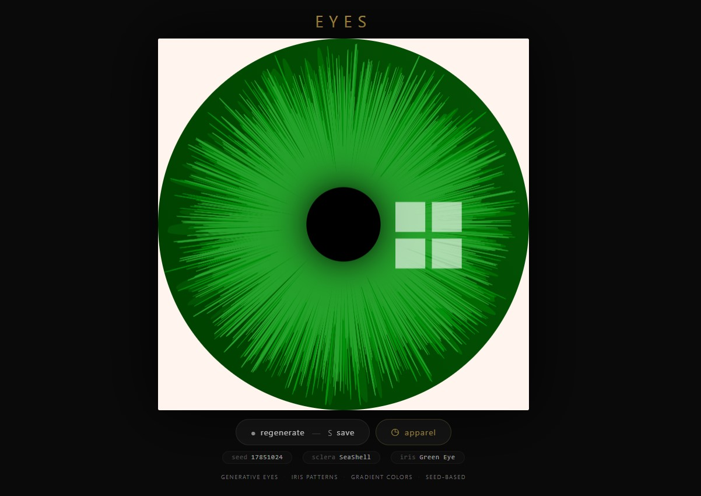
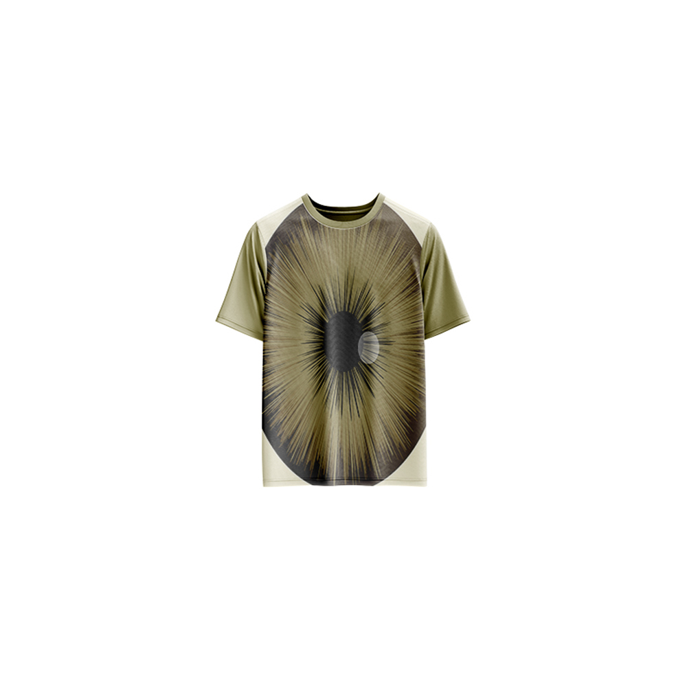

# Eyes — Generative Art

[](https://reyrove.github.io/Eyes-Generative-Art)
[](https://opensource.org/licenses/MIT)

> **Generative eye art.** Each refresh creates a unique, hyper-realistic eye with intricate iris patterns, gradient colors, soft highlights, and lifelike reflections.

## 🎨 Live Demo

<div align="center">
  <a href="https://reyrove.github.io/Eyes-Generative-Art" target="_blank">
    
  </a>
  <br><br>
  <a href="https://reyrove.github.io/Eyes-Generative-Art" target="_blank">
    
  </a>
  <br>
  <em>Click the image or button to experience the generative art</em>
</div>

## 👕 Apparel Preview

<div align="center">
  
  <br>
  <em>Eyes artwork printed on a T-shirt</em>
</div>

## ✨ Features

- **Generative Eyes** — Unique iris patterns every time
- **Iris Textures** — Layered bezier curves creating realistic iris detail
- **Rich Color Palettes** — 11 different eye color sets
- **Soft Sclera Colors** — 27 subtle background colors
- **Lifelike Highlights** — Random reflections and pupil detail
- **Gradient Iris** — Smooth color transitions in the iris
- **Seed-Based** — Every composition is unique and reproducible via its seed
- **Save & Share** — Download as PNG with seed in filename
- **Apparel Mode** — Preview artwork on a T-shirt mockup
- **Responsive** — Works on desktop, tablet, and mobile
- **Pure JavaScript** — No external dependencies
- **Keyboard Shortcuts**:
  - `R` — Regenerate
  - `S` — Save image
  - `T` — Toggle apparel view

## 🎨 Artwork Details

| Parameter | Options | Description |
|-----------|---------|-------------|
| **Iris Colors** | 11 sets | Blue, Hazel, Green, Brown, etc. |
| **Sclera Colors** | 27 options | Soft whites and subtle tints |
| **Iris Layers** | 4 layers | Deep, textured iris patterns |
| **Highlight Shape** | Random | Square or circular reflection |

## 👁️ Eye Color Palettes

| Name | Colors |
|------|--------|
| **Blue Eye** | Deep blue to bright cyan |
| **Dull Blue Eye** | Soft muted blues |
| **Ocean Eyes** | Teal and aqua tones |
| **Baggy Eye** | Purple and mauve tones |
| **Deep Blue Eye** | Rich navy to steel blue |
| **Bright Hazel Eye** | Warm browns and amber |
| **Brown Eye** | Rich dark browns |
| **Hazel Eye** | Golden browns and tans |
| **Green Eye** | Vibrant greens |
| **Azure Eye** | Bright blue to gold |
| **Steel Eye** | Cool grays and silver |

## 🚀 Quick Start

### Local Development

```bash
# Clone the repository
git clone https://github.com/reyrove/Eyes-Generative-Art.git

# Navigate to the directory
cd Eyes-Generative-Art

# Open in browser
open index.html
# or use a live server
```

### Deploy to GitHub Pages

1. Push to GitHub
2. Go to Settings → Pages
3. Select branch `main` and root folder
4. Your site will be live at `https://reyrove.github.io/Eyes-Generative-Art`

## 🧠 How It Works

The artwork is generated using a deterministic random number generator, seeded by timestamp + random noise. Every refresh:

1. **Setup**:
   - Random sclera color from 27 soft colors
   - Random iris color set from 11 options
   - Each color set contains 5 complementary colors

2. **Iris Generation**:
   - Base iris filled with gradient
   - 3-4 layers of bezier curves create texture
   - Each layer has random divisions (200-3000 points)
   - Layers have varying opacity and size

3. **Pupil & Highlights**:
   - Central black pupil with glow
   - Random reflection shape (square or circle)
   - Soft white highlight with feather effect

## 📁 File Structure

```
Eyes-Generative-Art/
├── index.html          # Main application (all-in-one)
├── Eyes.jpg            # T-shirt mockup image
├── fav.svg             # Favicon
├── demo-screenshot.jpg # Website demo screenshot
├── README.md           # This file
└── LICENSE             # MIT License
```

## 🛠️ Tech Stack

- **Pure Vanilla HTML/CSS/JS** — No dependencies
- **Canvas API** — 2D rendering
- **CSS Flexbox/Grid** — Responsive layout
- **GitHub Pages** — Hosting

## 🎯 Interactive Controls

| Action | Keyboard | Button |
|--------|----------|--------|
| Regenerate | `R` | Click "regenerate" |
| Save Image | `S` | Click "regenerate" |
| Toggle Apparel | `T` | Click "apparel" |

## 🎨 The Creative Process

### Iris Texture
The iris is created using multiple layers of bezier curves:
- **Layer 1**: Base gradient
- **Layer 2**: Fine texture (200-300 points)
- **Layer 3**: Medium texture (1000-3000 points)
- **Layer 4**: Coarse texture (1000-3000 points)

Each layer uses random point positions to create organic, realistic iris patterns.

### Color Palettes
Each eye color set contains 5 colors that transition from dark to light, creating depth and realism in the iris.

### Reflection & Highlights
A random highlight (square or circle) adds lifelike quality to the eye, with feathering for a soft, natural look.

## 📱 Responsive Design

The application automatically adapts to:
- Desktop screens
- Tablets
- Mobile phones
- Landscape orientation
- Various aspect ratios

## 🤝 Contributing

Contributions are welcome! Feel free to:
- Fork the repository
- Create a feature branch
- Submit a pull request

### Ideas for Contributions:
- New eye color palettes
- Different iris textures
- Animation features
- Interactive controls
- Performance optimizations

## 📄 License

MIT License — see [LICENSE](LICENSE) file for details.

## 🙏 Acknowledgments

- Inspired by the beauty of human eyes
- Pure JavaScript implementation
- Special thanks to the creative coding community

---

**Built with ❤️ and seeing eyes**